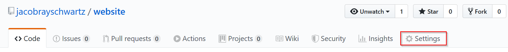
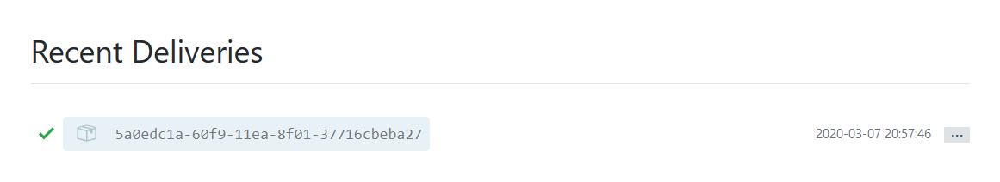

I'm not a website developer by trade, though I can do some of the work. Honestly, for years, I felt like I needed to build my own CMS from scratch or I wasn't a good enough developer. But I'm also a developer that has a tendancy to redo his work over and over again unless I have a deadline. 

So finally, I stopped trying to reinvent a wheel that has already been sufficiently discovered, modified, de- and reconstructed. Setting up Grav as a flat file CMS makes my life easy so I can focus on writing content. And at last, the website is opperational.

<iframe class="centered" src='https://gfycat.com/ifr/FarflungSameCornsnake' frameborder='0' scrolling='no' allowfullscreen width='640' height='404'></iframe>

<div class="mt-25"></div>

I use Git as the version control for this site. Normally, I like to be very disciplined with my projects at work with Git and branching. But, since I'm the only developer for this website, and I'm mostly trustworthy, I don't really use any branching scheme. 

What I really love Git for is two things:

1. History, I can rewind to any point as needed
2. Webhooks, I don't have to bother with handling website deployment. Just push the changes, and I'm done. 

The first point is well discussed by many people online more eloquent than I. For this article, I want to focus on that second point. 

## Webhooks

For the uninitiated, webhooks are simply events sent as HTTP requests from some other server (or client). Usually they are implemented for server-to-server communication, and are a great alternative to things like MQTT for more decentrilized environments. 

Here, I use Github's webhooks to trigger a simple script on my webserver to initiate a `git pull` any time I push to the repo. This makes sure the website is up to date with the git repository automatically. 

You can see an example workflow for Github's webhooks below:

## Webhook listener

You can implement a webhook listener as part of your website's server application, but I recommend separating the two so it's easier to fix one without breaking the other, and so you can set up the listener on a different port than your website. 

For this excercise, I'll be using Node JS, though many languages have similar functionality. For creating a webhook listener for running git commands, you need an http server and the ability to execute shell commands. 

### A Sample Node Application

Here's a very basic Node app that can listen for webhooks using [restify](https://restify.com):

*server.js*
```javascript
const restify = require('restify');

const port = 1234; //Port to listen on
const hostname = "mywebsite.com"; //hostname to listen on

//Set up the server to process GET query variables and other method's bodies
const server = restify.createServer();
server.use(restify.plugins.queryParser());
server.use(restify.plugins.bodyParser({
  requestBodyOnGet: true
}));

//Set up a single POST route
server.post('/github/push-event', (req, res, next) => {
  res.statusCode = 200;
  res.send("Hello, world!");
});

//Begin listening on the given port and host
server.listen(port, hostname, () => {
  console.log(`Running at port ${port} host ${hostname}`);
});
```

This small app will set up a webserver on the supplied port and host and create one route at `/github/push-event`, which will return a simple "Hello, World!" message. 

### Adding a script

This is all well and good, but now we need to actually do something when we get a request. So, we'll do a few things:

1. Create a simple bash script to cd into a given directory and run a git pull
2. Add code to execute that script when a POST request is sent to `/github/pull-event`
3. Set up the webhook from our repository in Github
4. Ensure that the script is only run when the appropriate secret is sent with the request

#### 1. Create the bash script

We'll create a bash script with just a few commands to make our lives easier. Here's the content:

```bash
#!/bin/bash

cd $1 # Change directory to the path given as the first argument to this script
git pull # Run the git pull command

```

This script should be placed somewhere it's easy for you to access from a daemon user, such as www-data. You can use the `/usr/bin` folder. Be sure to give it execute permissions: `chmod +x /usr/bin/gitPullScript.sh`

#### 2. Setting up your webhook

Generate a unique secret. This will be passed by github with every webhook. This string can be used to ensure the sender is who we want it to be (Github), and not some other entity.

You can use any string. In this tutorial, we'll use a GUID. You can generate one in bash like so:
```bash
$ uuidgen
21aa5b72-9515-4235-b90c-5c7aef1e59bd
```

<div class="mb-25"></div>

Now, log into Github and open the repository you want to create the webhook for. Select **Settings**.


<div class="mb-25"></div>

Select the **Webhooks** button from the menu and click the **Add Webhook** button.


<div class="mb-25"></div>

Fill out the webhook form with the endpoint you'll receive the webhook at. Make sure to fill out the secret with the string you generated earlier. 


#### 3. Execute the script

Let's modify the Node app a little to execute our script. Below is the same webserver we wrote previously, with added logging and an execute function. 

*server.js*
```javascript
const restify = require('restify');
const Logger = require('bunyan');
const util = require('util');
const exec = util.promisify(require('child_process').exec);

const port = 1234; //Port to listen on
const hostname = 'mywebsite.com'; //hostname to listen on
const scriptPath = '/usr/bin/gitPullScript.sh' //Path to script from step 1
const websitePath = '/var/www' //Path of dir where website is located


const log = new Logger({name: 'WebhookLogger'}); //Set up a log for extra troubleshooting

//Set up the server to process GET query variables and other method's bodies
const server = restify.createServer({log}); //Add the logger here
server.use(restify.plugins.queryParser());
server.use(restify.plugins.bodyParser({
  requestBodyOnGet: true
}));

//Set up a single POST route
server.post('/github/push-event', (req, res, next) => {
  exec(scriptPath + " " + websitePath).then(() => {
  	// Script completed successfully
  	server.log.info('Webhook completed successfully');
  	res.statusCode = 200;
  	res.send('Executed successfully!');
  },
  (err) => {
  	// Script failed to complete
  	server.log.error('Failed to execute webhook', {err})
  	res.statusCode = 500;
  	res.send('Error executing webhook, see server logs for details');
  })
});

//Begin listening on the given port and host
server.listen(port, hostname, () => {
  server.log.info(`Running at port ${port} host ${hostname}`);
});
```

Here, we have added the shell execution using promises. For receiving webhooks, your http server should return a 200 status code if all things are ok. If the script fails for any reason, the server will return a 500 Internal Server Error. 

#### 4. Add the secret to your webhook code

Now that we have the secret from the github setup, we need to make sure that only requests containing the correct secret will run the script. This helps to filter out malicious requests. 

Here, we'll use a `.env` file to store the secret. 

*.env*
```
PUSHSECRET=21aa5b72-9515-4235-b90c-5c7aef1e59bd
```

*server.js*
```javascript
const restify = require('restify');
const Logger = require('bunyan');
const util = require('util');
const dotenv = require('dotenv');
const exec = util.promisify(require('child_process').exec);

dotenv.config(); //Read config file

const port = 1234; //Port to listen on
const hostname = 'localhost'; //hostname to listen on
const scriptPath = '/usr/bin/gitPullScript.sh'; //Path to script from step 1
const websitePath = '/var/www'; //Path of dir where website is located
const secret = process.env.PUSHSECRET; //Must be included with request
```

Now, add code to check for the secret in the payload before running the script:

*server.js*
```javascript
//Set up a single POST route
server.post('/github/push-event', (req, res, next) => {
  if(!req.body || !req.body.hasOwnProperty('secret')){
    res.statusCode = 400;
    res.send('Missing secret');
    return next();
  }

  if(req.body['secret'] !== secret){
    res.statusCode = 401;
    res.send('Incorrect secret');
    return next();
  }

  exec(scriptPath + " " + websitePath).then(() => {
        // Script completed successfully
        server.log.info('Webhook completed successfully');
        res.statusCode = 200;
        res.send('Executed successfully!');
        next();
      },
      (err) => {
        // Script failed to complete
        server.log.error('Failed to execute webhook', {err});
        res.statusCode = 500;
        res.send('Error executing webhook, see server logs for details');
        next();
      })
});
```

### The Final Script
So, all said and done, we should have the following in the **`server.js`** file:

```javascript
const restify = require('restify');
const Logger = require('bunyan');
const util = require('util');
const dotenv = require('dotenv');
const exec = util.promisify(require('child_process').exec);

dotenv.config();

const port = 1234; //Port to listen on
const hostname = 'localhost'; //hostname to listen on
const scriptPath = '/usr/bin/gitPullScript.sh'; //Path to script from step 1
const websitePath = '/var/www'; //Path of dir where website is located
const secret = process.env.PUSHSECRET; //Must be included with request


const log = new Logger({name: 'WebhookLogger'}); //Set up a log for extra troubleshooting

//Set up the server to process GET query variables and other method's bodies
const server = restify.createServer({log}); //Add the logger here
server.use(restify.plugins.queryParser());
server.use(restify.plugins.bodyParser({
  requestBodyOnGet: true
}));

//Set up a single POST route
server.post('/github/push-event', (req, res, next) => {
  if(!req.body || !req.body.hasOwnProperty('secret')){
    res.statusCode = 400;
    res.send('Missing secret');
    return next();
  }

  if(req.body['secret'] !== secret){
    res.statusCode = 401;
    res.send('Incorrect secret');
    return next();
  }

  exec(scriptPath + " " + websitePath).then(() => {
        // Script completed successfully
        server.log.info('Webhook completed successfully');
        res.statusCode = 200;
        res.send('Executed successfully!');
        next();
      },
      (err) => {
        // Script failed to complete
        server.log.error('Failed to execute webhook', {err});
        res.statusCode = 500;
        res.send('Error executing webhook, see server logs for details');
        next();
      })
});

server.listen(port, hostname, () => {
  server.log.info(`Running at port ${port} host ${hostname}`)
});
```

Start the server using the command:

```bash
> node server.js
```

You can now test this by pushing to your repository, you should see a success message at the bottom of the webhooks settings page on your repository like so:



## Conclusion
And that's it! Well, for now. There's more to come, you'll want to set up a service to run the application in the background, use https to listen for the webhook and more. But that will come in the next post. 